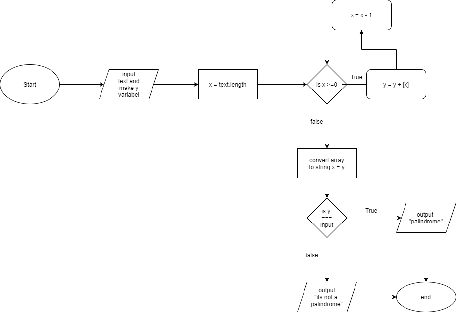
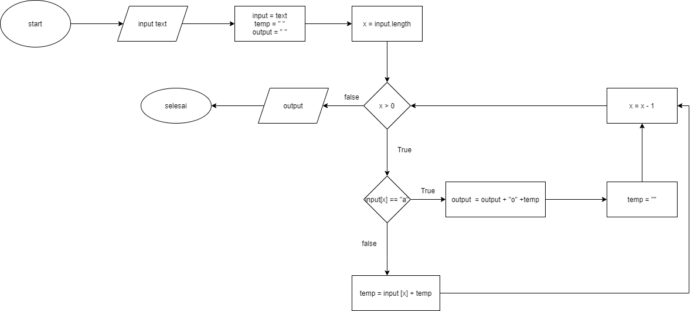

# **Palindrom**

## A. Algoritma Palindrome

1. Mulai
2. Inputkan kalimat
3. Masukan kalimat ke variabel input, buat variable temp dan juga buat variable output
4. Hitung banyaknya karakter di kalimat dan masukan ke variable x
5. cek nilai variable x apakah lebih besar dari 0
6. Jika True, cek apakah karakter tersebut merupakan karakter spasi
7. Jika Karakter bukan spasi Tampilkan karakter berdasarkan urutan nilai dari variable x dan masukan ke variable temp
8. Setelah itu kurangi 1 nilai variable x dan ulangi step ke 5
9. Jika Karakter merupakan (true) spasi tampilkan nilai variable output, spasi, variable temp dan masukan ke variable output
10. Reset (kosongkan) nilai variable temp
11. Setelah itu kurangi 1 nilai variable x dan ulangi step ke 5
12. Jika False (nilai variable x lebih kecil dari 0), Tampilkan variable output
13. Selesai

## B. Flowchart Palindrom

# **Reverse Words**

## A. Algoritma Reverse Words

1. Mulai
2. Inputkan kalimat
3. Masukan kalimat ke variabel input, buat variable temp dan juga buat variable output
4. Hitung banyaknya karakter di kalimat dan masukan ke variable x
5. cek nilai variable x apakah lebih besar dari 0
6. Jika True, cek apakah karakter tersebut merupakan karakter spasi
7. Jika Karakter bukan spasi Tampilkan karakter berdasarkan urutan nilai dari variable x dan masukan ke variable temp
8. Setelah itu kurangi 1 nilai variable x dan ulangi step ke 5
9. Jika Karakter merupakan spasi tampilkan nilai variable output, spasi, variable temp dan masukan ke variable output
10. Reset nilai variable temp
11. Setelah itu kurangi 1 nilai variable x dan ulangi step ke 5
12. Jika False, Tampilkan variable output
13. Selesai 

## B. Flowchart Reverse Words

# **Ganti Huruf**

## A. Algoritma Ganti Huruf

1. Mulai
2. Inputkan teks "Surabaya"
3. Masukan teks ke variable input, buat variable temp lalu variable ouput
4. Hitung banyaknya karakter di teks dan masukan ke variable x
5. Cek nilai variable x apakah lebih besar dari 0
6. apabila True cek apakah karakter tersebut merupakan karakter huruf a
7. Jika Karakter bukan karakter huruf a Tampilkan karakter berdasarkan urutan nilai dari variable x dan masukan ke variable temp
8. Setelah itu kurangi 1 nilai variable x dan ulangi step ke 5
9. Jika Karakter merupakan karakter huruf a tampilkan nilai variable temp, rubah karakter a menjadi o, variable output dan masukan ke variable output
10. Reset nilai variable temp
11. Setelah itu kurangi 1 nilai variable x dan ulangi step ke 5
12. Jika False Tampilkan variable output
13. Selesai

## B. Flowchart Ganti Huruf

